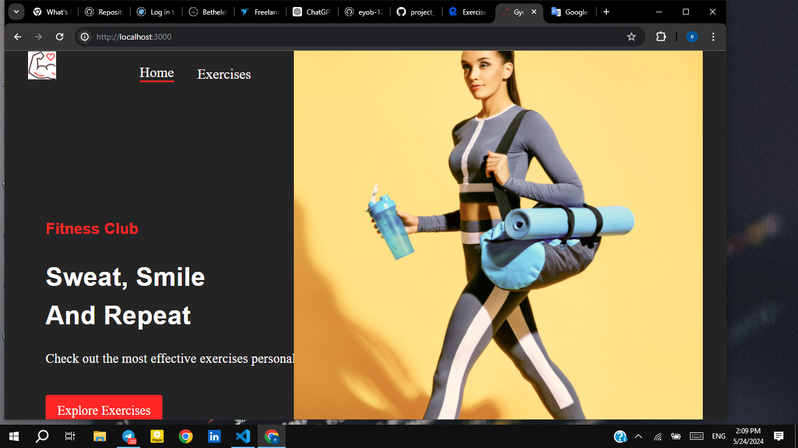
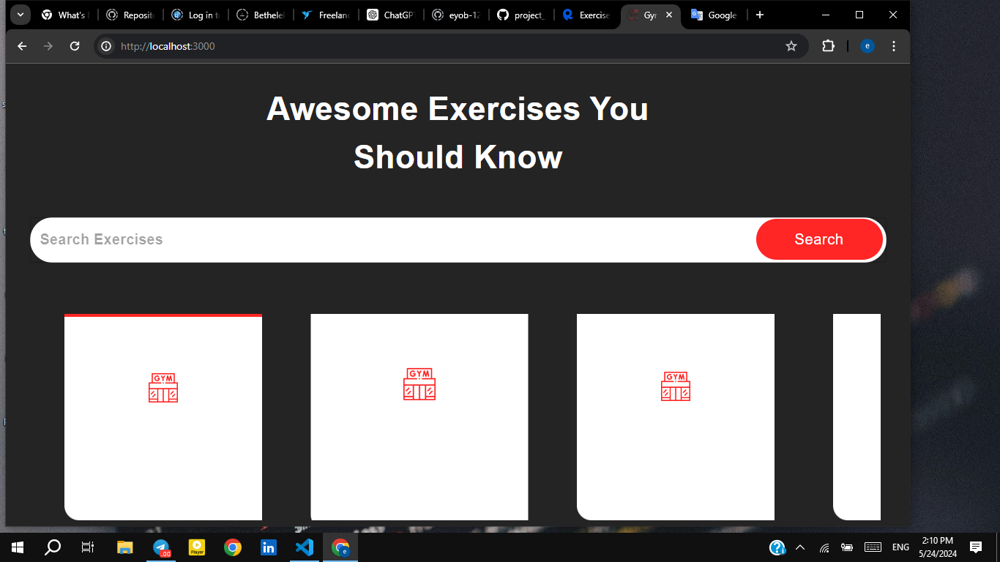
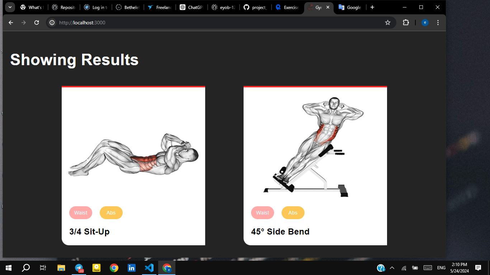
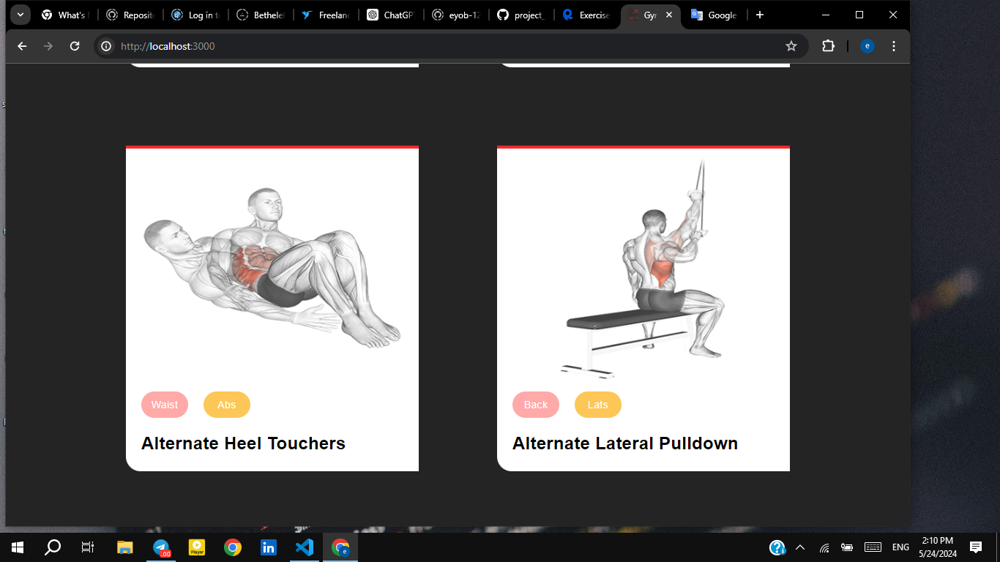

# FitnessApp

FitnessApp is a React-based application that helps users explore and track various exercises. The app integrates with the Rapid API to fetch exercise data and provides detailed views for each exercise.

## Table of Contents

- [Features](#features)
- [Installation](#installation)
- [Usage](#usage)
- [Rapid API Integration](#rapid-api-integration)
- [Dependencies](#dependencies)
- [Troubleshooting](#troubleshooting)
- [Contributing](#contributing)
- [License](#license)

## Features

- Explore various exercises
- View detailed information about each exercise
- Responsive design with Material-UI components
- Smooth horizontal scrolling for exercise categories
- Integrated with Rapid API for exercise data

## Installation

To set up the project locally, follow these steps:

1. **Clone the repository:**

   ```sh
   git clone https://github.com/yourusername/fitnessApp.git
   cd fitnessApp
 
 
 
 
